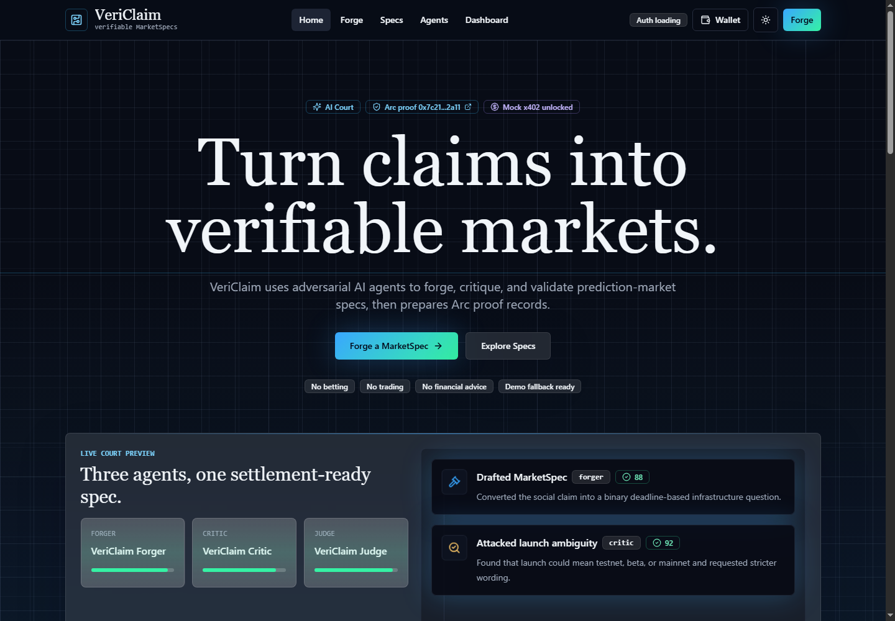
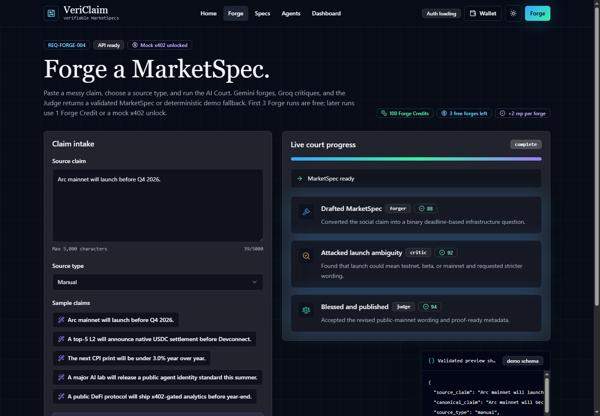

# VeriClaim

[](https://nextjs.org/)
[](https://firebase.google.com/)
[](https://testnet.arcscan.app/)
[](docs/x402-integration.md)

VeriClaim turns messy internet claims into verifiable prediction-market specs
using an adversarial AI agent flow.

It is a MarketSpec infrastructure project for converting vague claims, rumors,
announcements, and social posts into structured, auditable market definitions
that can be reviewed, challenged, shared, and later anchored to proof
infrastructure.

Live demo: https://veri-claim-livid.vercel.app

Repository: https://github.com/Achal13jain/VeriClaim

## Screenshots

| Landing page | Forge workflow |
| --- | --- |
|  |  |

## Problem

Prediction markets depend on well-formed questions. A claim such as "Bitcoin
will hit $150k this year" is not enough by itself. It needs a deadline, outcome
set, resolution source, objective resolution rule, edge cases, and ambiguity
review before it is usable.

VeriClaim focuses on that missing preparation layer. It does not create betting
markets, execute trades, or provide financial advice. It only creates structured
MarketSpecs.

## How It Works

1. A user submits a claim and source type.
2. The Forger Agent converts it into a binary, time-bound MarketSpec.
3. The Critic Agent attacks ambiguity, weak sources, deadlines, and edge cases.
4. The Judge Agent produces a verdict and final resolution wording.
5. The user can save the MarketSpec, share its public page, challenge it, and
   publish a mock Arc proof record.

## Current Features

- Forger, Critic, and Judge agent flow.
- MarketSpec generation through `/api/forge`.
- Relative date handling for phrases such as "this year", "next month", and
  "before Q4".
- Zod validation for API inputs and outputs.
- Deterministic fallback mode when provider keys are missing.
- Firebase Auth with Google and anonymous demo sign-in.
- Firestore persistence for users, specs, challenges, activity, payments, and
  mock proof metadata.
- Public spec pages at `/spec/[hash]`.
- Deterministic MarketSpec hashing using canonical JSON plus SHA-256.
- Challenge Court for challenging ambiguous or weak specs.
- Credits, reputation, user levels, badges, and activity feed.
- Dashboard with stats, leaderboard, recent activity, and payment history.
- Mock Arc proof publishing.
- Mock x402-style unlock flow after free Forge generations.

## Safety Boundaries

- VeriClaim does not create betting markets.
- VeriClaim does not execute trades.
- VeriClaim does not provide financial advice.
- VeriClaim only creates structured MarketSpecs.
- Mock Arc proof publishing is labeled as mock/testnet metadata.
- Mock x402 unlocks do not move real money.

## Tech Stack

- Next.js 15 App Router
- React 19
- TypeScript
- Tailwind CSS
- shadcn/ui-style primitives
- Framer Motion
- GSAP + ScrollTrigger
- Lenis
- Lucide React
- Recharts
- Zod
- Firebase Auth
- Firestore
- wagmi + viem
- Solidity and Foundry workspace for future Arc contract deployment

## Project Structure

```text
src/app/                 Next.js pages and API routes
src/components/          UI, page, payment, auth, and spec components
src/lib/agents/          Agent schemas, provider adapters, prompts, fallback
src/lib/firebase/        Firebase client Auth and Firestore helpers
src/lib/gamification/    Credits, reputation, levels, and badges
src/lib/payments/        Mock x402 payment abstraction
src/lib/arc/             Mock Arc proof helpers and future contract config
src/lib/utils/           Canonicalization and deterministic hashing
contracts/               Deferred Arc registry contract workspace
docs/                    Setup, integration, release, and demo notes
```

## Local Setup

Install dependencies:

```bash
npm install
```

Copy the environment template:

```bash
cp .env.example .env.local
```

Start the development server:

```bash
npm run dev
```

Open `http://localhost:3000`.

Run checks:

```bash
npm run typecheck
npm run lint
npm run build
```

## Environment Variables

The app remains usable without live AI keys by falling back to deterministic demo
responses. Firebase browser config is required for sign-in and persistence.

Required for the interactive app:

```bash
NEXT_PUBLIC_APP_URL=
GEMINI_API_KEY=
GEMINI_MODEL=gemini-2.5-flash
GROQ_API_KEY=
GROQ_MODEL=
OPENAI_API_KEY=
OPENAI_MODEL=
OPENROUTER_API_KEY=
OPENROUTER_MODEL=
NEXT_PUBLIC_FIREBASE_API_KEY=
NEXT_PUBLIC_FIREBASE_AUTH_DOMAIN=
NEXT_PUBLIC_FIREBASE_PROJECT_ID=
NEXT_PUBLIC_FIREBASE_STORAGE_BUCKET=
NEXT_PUBLIC_FIREBASE_MESSAGING_SENDER_ID=
NEXT_PUBLIC_FIREBASE_APP_ID=
NEXT_PUBLIC_X402_MODE=mock
X402_PRICE_USD=0.01
X402_RECEIVER_ADDRESS=
NEXT_PUBLIC_ARC_CHAIN_ID=5042002
NEXT_PUBLIC_ARC_RPC_URL=
NEXT_PUBLIC_VERICLAIM_CONTRACT_ADDRESS=
```

Keep private keys and provider secrets out of `NEXT_PUBLIC_*` variables.

## Firebase Setup

1. Create a Firebase project.
2. Add a Web app and copy the browser config into `.env.local`.
3. Enable Google sign-in.
4. Enable Anonymous sign-in if you want the Demo button to work.
5. Create Firestore in production mode.
6. Deploy the included Firestore rules:

```bash
firebase deploy --project <project-id> --only firestore:rules
```

7. In Firebase Auth settings, add authorized domains:
   - `localhost`
   - your Vercel production domain
   - any Vercel preview domains used for demos

More detail is available in `docs/firebase-setup.md`.

## Vercel Deployment

1. Import the repository into Vercel.
2. Use `npm install` for install and `npm run build` for build.
3. Add the required environment variables.
4. Set `NEXT_PUBLIC_APP_URL` to the deployed URL.
5. Deploy.
6. Add the deployed domain to Firebase Auth authorized domains.
7. Deploy Firestore rules to the same Firebase project used by the app.

## Arc

VeriClaim is designed for Arc-native market infrastructure.

Current implementation:

- uses mock Arc proof publishing
- stores Arc-ready proof metadata
- does not yet publish real transactions to Arc

Install the Arc CLI:

```bash
uv tool install git+https://github.com/the-canteen-dev/ARC-cli
```

Future Arc work:

- deploy `VeriClaimRegistry` to Arc Testnet
- replace mock proof flow with real contract publishing
- anchor MarketSpec hashes on Arc

The `contracts/` folder contains the registry contract workspace. Real Arc
publishing will replace the mock proof flow once the contract is deployed and
the frontend is connected to the registry address.

## x402

Current implementation uses mock x402-style unlocks:

- first 3 Forge generations are free
- later Forge actions can use 1 Forge Credit or a mock unlock
- no real payment is processed

Real x402 integration is planned later.

## Known Limitations

- Arc publishing is currently mock mode.
- x402 unlocks are currently mock mode.
- Firebase Admin SDK is not used yet.
- Credits, reputation, mock payments, challenges, and mock proof writes are not
  fully server-authoritative yet.
- `/api/forge` is rate-limited in memory and can still be called directly.
- Public spec pages use generic OpenGraph metadata; per-spec images are planned.
- Agent identity and ERC-8004 adapter support are represented as planned
  integration work.

## Additional Docs

- `docs/ARCHITECTURE.md`
- `docs/ARC_CLI_NOTES.md`
- `docs/DEMO_SCRIPT.md`
- `docs/firebase-setup.md`
- `docs/arc-integration.md`
- `docs/x402-integration.md`

## Roadmap

- Move privileged economy, challenge, payment, and proof writes behind
  server-side Firebase Admin routes.
- Enforce Forge Credit and x402 unlocks server-side.
- Deploy the Arc Testnet registry contract.
- Switch proof publishing from mock metadata to real Arc transactions.
- Integrate real x402 facilitator support.
- Add per-spec OpenGraph images for public spec pages.
- Persist agent identity metadata and expand ERC-8004 adapter support.
- Add CI, browser smoke tests, and Foundry contract tests.

## License

MIT. See `LICENSE`.
